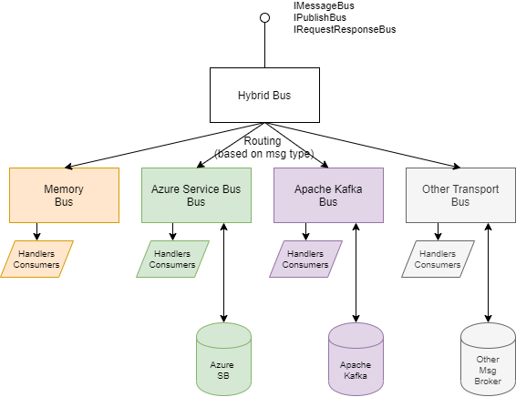
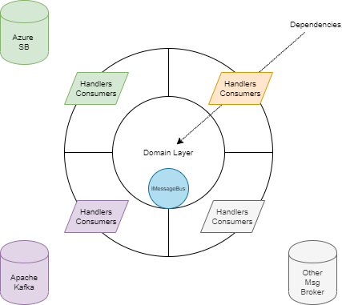

# Hybrid Provider for SlimMessageBus

## Introduction

Please read the [Introduction](intro.md) before reading this provider documentation.

## What is the Hybrid provider?

The Hybrid bus enables a composition of other available transport providers into one bus that your entire application / service uses.
This allows different layers of your service to work with just one `IMessageBus` interface, and relaying on the Hybrid bus to route your message to the respective transport provider based on configuration.

Package: [SlimMessageBus.Host.Hybrid](https://www.nuget.org/packages/SlimMessageBus.Host.Hybrid/)



## Use cases

A typical example would be when your service has a domain layer which uses domain events passed in memory (SlimMessageBus.Host.Memory transport), but any other layer (application or adapter) need to communicate with the outside world using something like Azure Service Bus or Apache Kafka transports.



## Configuration

Here is an example configuration taken from [Sample.Hybrid.ConsoleApp](../src/Samples/Sample.Hybrid.ConsoleApp) sample:

```cs
public IMessageBus CreateMessageBus(IServiceProvider svp)
{
    var hybridBusSettings = new HybridMessageBusSettings
    {
        // Bus 1
        ["Memory"] = builder =>
        {
            builder
                .Produce<CustomerEmailChangedEvent>(x => x.DefaultTopic(x.Settings.MessageType.Name))
                .Consume<CustomerEmailChangedEvent>(x => x.Topic(x.MessageType.Name).WithConsumer<CustomerChangedEventHandler>())
                .WithProviderMemory(new MemoryMessageBusSettings { EnableMessageSerialization = false });
        },
        // Bus 2
        ["AzureSB"] = builder =>
        {
            var serviceBusConnectionString = Secrets.Service.PopulateSecrets(Configuration["Azure:ServiceBus"]);
            builder
                .Produce<SendEmailCommand>(x => x.DefaultQueue("test-ping-queue"))
                .Consume<SendEmailCommand>(x => x.Queue("test-ping-queue").WithConsumer<SmtpEmailService>())
                .WithProviderServiceBus(new ServiceBusMessageBusSettings(serviceBusConnectionString));
        }
    };

    var mbb = MessageBusBuilder.Create()
        .WithDependencyResolver(new LookupDependencyResolver(svp.GetRequiredService)) // DI setup will be shared
        .WithSerializer(new JsonMessageSerializer()) // serialization setup will be shared between bus 1 and 2
        .WithProviderHybrid(hybridBusSettings); 

    // In summary:
    // - The CustomerChangedEvent messages will be going through the SMB Memory provider.
    // - The SendEmailCommand messages will be going through the SMB Azure Service Bus provider.
    // - Each of the bus providers will serialize messages using JSON and use the same DI to resolve consumers/handlers.
    var mb = mbb.Build();
    return mb;
}
```

Above we define the hybrid bus as consisting of two transports - Memory and Azure Service Bus:

* The message type `CustomerEmailChangedEvent` published will be routed to the memory bus for delivery.
* Converely, the `SendEmailCommand` will be routed to the Azure Service Bus transport.

> Currently, routing is determined based on message type. Because of that you cannot have the same message type handled by different bus transports.

The `IMessageBus` injected into any layer of your application will in fact be the hybrid bus, therefore production of a message will be routed to the repective bus implementation (memory or Azure SB in our example).

It is important to understand, that handlers (`IHandler<>`) or consumers (`IConsumer<>`) registered will be managed by the respective child bus that they are configured on.

### Shared configuration

Any setting applied at the hybrid bus builder level will be inherited by ech child transport bus. In the example mentioned, the memory and Azure SB busses will inherit the serializer and dependency resolver.

Individual child busses can provide their own serialization (or any other setting) and effectively override the serialization (or any other setting).

> The Hybrid bus builder configurations of the producer (`Produce()`) and consumer (`Consume()`) will be added into every child bus producer/consumer registration list.
