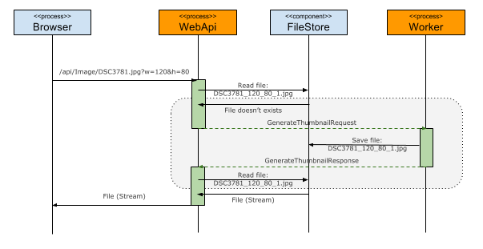

## Sample.Images

Sample project that uses request-response to generate image thumbnails. It consists of two main applications:
* WebApi (ASP.NET Core 2.0 WebApi)
* Worker (.NET Core 2.0 Console App)

The WebApi serves thumbnails of an original image given the desired *Width x Height*. To request a thumbnail of size `120x80` of the image `DSC0843.jpg` use:

`http://localhost:56788/api/image/DSC3781.jpg/r/?w=120&h=80&mode=1`

The thumbnail generation happens on the Worker. Because the image resizing is an CPU/memory intensive operation, the number of workers can be scaled out as load increases.

The orignal images and produced thumbnails cache reside on disk in folder: `.\SlimMessageBus\src\Samples\Content\`

To obtain the original image use:

`http://localhost:56788/api/image/DSC3781.jpg`

When a thumbnail of the specified size already exists it will be served by WebApi, otherwise a request message is sent to Worker to perform processing. When the Worker generates the thumbnail it responds with a response message.

**Sequence diagram**



**Key snippet**

The `ImageController` has a method that serves thumbnails. Note the 8th line which is async and resolves when the Worker responds:
```cs
        [HttpGet("{fileId}/r")]
        public async Task<ActionResult> GetImageThumbnail(string fileId, [FromQuery] ThumbnailMode mode, [FromQuery] int w, [FromQuery] int h, CancellationToken cancellationToken)
        {
            var thumbFileId = _fileIdStrategy.GetFileId(fileId, w, h, mode);

            var thumbFileContent = await _fileStore.GetFile(thumbFileId);
            if (thumbFileContent == null)
            {
                try
                {
                    var thumbGenResponse = await _bus.Send(new GenerateThumbnailRequest(fileId, mode, w, h), cancellationToken);
                    thumbFileContent = await _fileStore.GetFile(thumbGenResponse.FileId);
                }
                catch (RequestHandlerFaultedMessageBusException)
                {
                    // The request handler for GenerateThumbnailRequest failed
                    return NotFound();
                }
                catch (OperationCanceledException)
                {
                    // The request was cancelled (HTTP connection cancelled, or request timed out)
                    return StatusCode(StatusCodes.Status503ServiceUnavailable, "The request was cancelled");
                }
            }

            return ServeStream(thumbFileContent);
        }
```

The `GenerateThumbnailRequestHandler` handles the resizing operation on the Worker side:
```cs
    public class GenerateThumbnailRequestHandler : IRequestHandler<GenerateThumbnailRequest, GenerateThumbnailResponse>
    {
        private readonly IFileStore _fileStore;
        private readonly IThumbnailFileIdStrategy _fileIdStrategy;

		// ...
		
        public async Task<GenerateThumbnailResponse> OnHandle(GenerateThumbnailRequest request, string topic)
        {
            var image = await LoadImage(request.FileId);
            if (image == null)
            {
                // Note: This will cause RequestHandlerFaultedMessageBusException thrown on the other side (IRequestResponseBus.Send() method)
                throw new InvalidOperationException($"Image with id '{request.FileId}' does not exist");
            }
            using (image)
            {
                var thumbnailFileId = _fileIdStrategy.GetFileId(request.FileId, request.Width, request.Height, request.Mode);
                var thumbnail = ScaleToFitInside(image, request.Width, request.Height);

                using (thumbnail)
                {
                    SaveImage(thumbnailFileId, thumbnail);

                    return new GenerateThumbnailResponse
                    {
                        FileId = thumbnailFileId
                    };
                }                
            }
        }

		// ...
	}	

```
